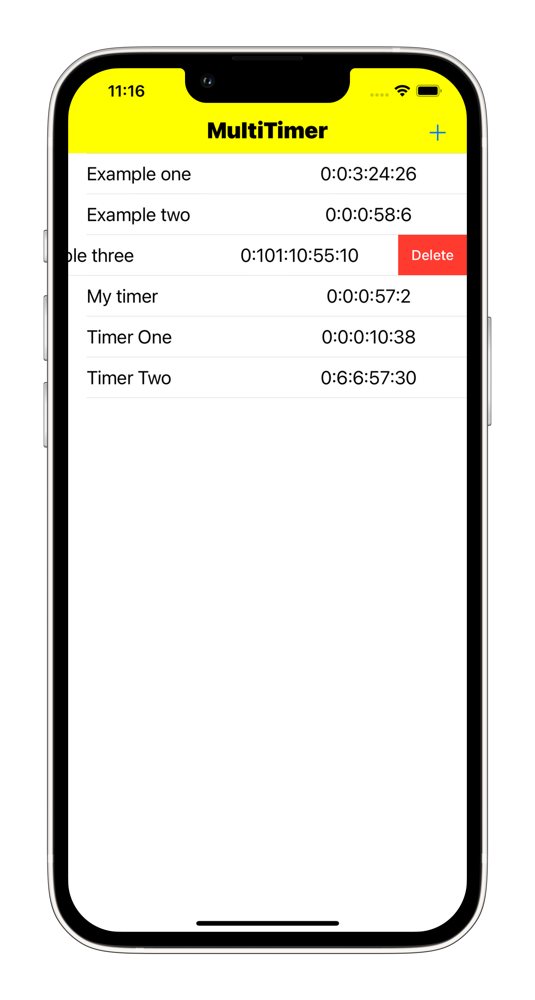

# Timers
## Table with independent timers


The user creates a timer by clicking on the "+" button on the top panel.
In the window that appears, the user specifies an arbitrary timer name and sets the time interval. Each new timer is added to the table. The timer has a countdown. After the time has elapsed, the timer is removed from the table.

---

When scrolling the table, the timers stopped counting down the time. This was solved by adding a timer to the current Run Loop in Common mode

``` 

RunLoop.current.add(timer, forMode: .common)

```


Now, even when interacting with the interface, the timer will work correctly.

---


